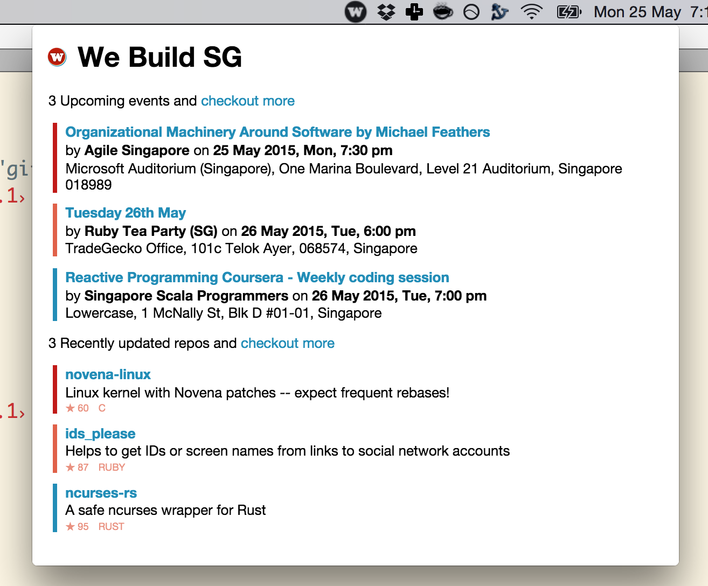

[](https://travis-ci.org/webuildsg/osx) [](https://gemnasium.com/webuildsg/osx)

#webuild sg menubar

> a tiny OS X menubar app to display the upcoming events and recently updated repos from webuild.sg



## getting started

1. download [the latest app](https://github.com/webuildsg/osx/releases) and move it to your `Applications` folder.
- double-click to open the menubar app

## install

1. install packages

  ```sh
  npm i
  ```
- run the app from command line without building it

  ```sh
  npm start
  ```
- build the app to create `WeBuildSG.app.zip`

  ```sh
  npm run build
  ```

## credits

1. [menubar](https://github.com/maxogden/menubar)
- [boilerplate](https://github.com/sindresorhus/electron-boilerplate/tree/master/boilerplate)
- [css loader](https://github.com/jlong/css-spinners/blob/master/css/spinner/three-quarters.css)

## license

[MIT](/LICENSE)
